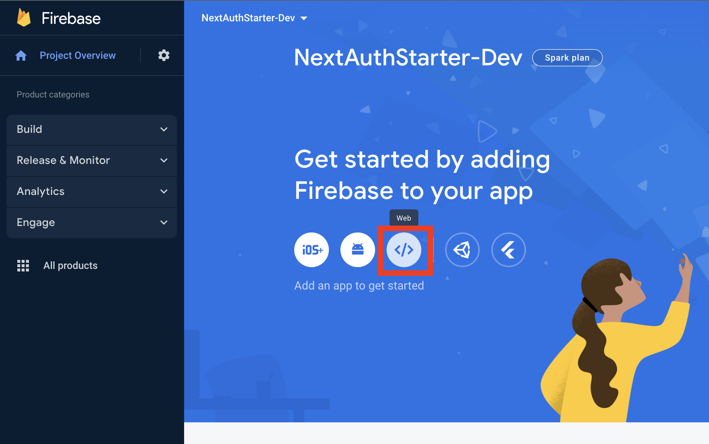
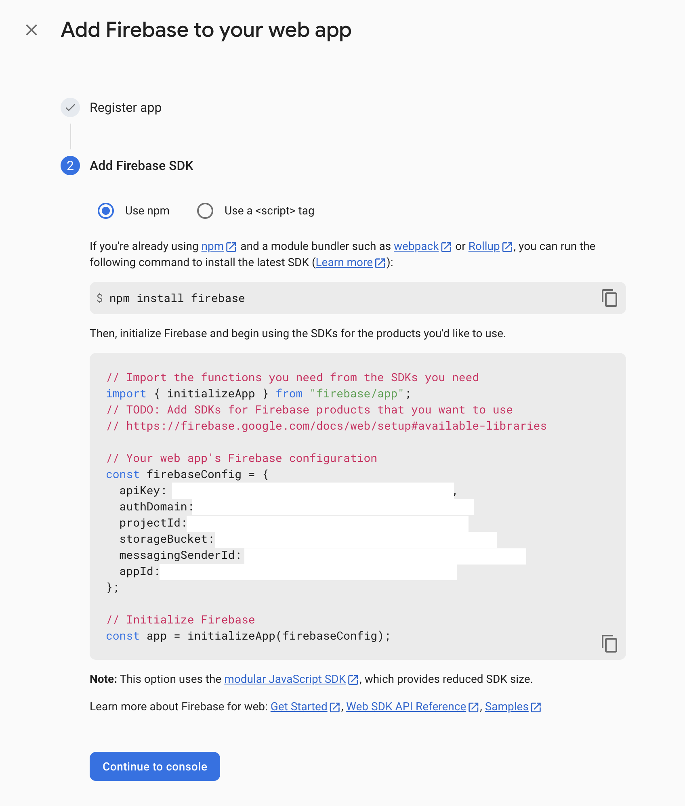

This is a [Next.js](https://nextjs.org/) project bootstrapped with [`create-next-app`](https://github.com/vercel/next.js/tree/canary/packages/create-next-app).

## Getting Started

### Step 1: Install the dependencies:

```bash
pnpm i
```

### Step 2: Create a .env.local file

Duplicate the .env.example file in NextAuthExample/apps/web/ and name it .env.local

### Step 3: Set up firebase

First, create a firebase project [here](https://firebase.google.com/)

After the project is created, select "web" to begin creating the config that we'll use:


Copy the firebase config values and update the client section in the .env.local file from step 2


```
# Client
#   Firebase
NEXT_PUBLIC_FIREBASE_API_KEY=""
NEXT_PUBLIC_FIREBASE_AUTH_DOMAIN=""
NEXT_PUBLIC_FIREBASE_PROJECT_ID=""
NEXT_PUBLIC_FIREBASE_STORAGE_BUCKET=""
NEXT_PUBLIC_FIREBASE_MESSAGING_SENDER_ID=""
NEXT_PUBLIC_FIREBASE_APP_ID=""
```

Next, in firebase, enable authentication and add the email/password and google providers

After those are added, go to settings > Service accounts and Generate new private key for Node.js. This will generate and download a json file.

Update the following key values in .env.local with the values from the downloaded config

```
FIREBASE_CLIENT_EMAIL=""
FIREBASE_PRIVATE_KEY=""
```

Note: FIREBASE_PUBLIC_STORAGE_BUCKET and FIREBASE_PUBLIC_PROJECT_ID are the same values used for the client section

### Step 4: Create a Vercel project and database

Head on over to Vercel and create a project and database. Optionally, you can create a local database and use that instead.

When creating the project, you'll likely want to push your project up to GitHub first, so you can import it from Vercel.
